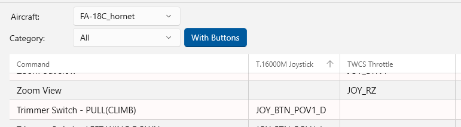

## Bindings Page

- [Back](Introduction.md)

### Overview

The Bindings page displays the current bindings for each of your Joysticks in table format.

This page is only available when a Game instance has been selected.

The bindings displayed are loaded from DCS each time you start the application.

### Page Controls

- **Aircraft** - Display joystick bindings for this Aircraft.
- **Category** - Filter the displayed bindings by DCS category.
- **With Buttons** - When slected filters bindings to only display those that have an assiged joystick button.
- **Column Headings** - Selecting a column heading will sort the bindings by that column, selecting it again will reverse the sort direction.
- **Column Headings** - Clicking and dragging a heading allows for reodering of the columns.
- **Scrolling** - the bindings table can be scrolled as required.