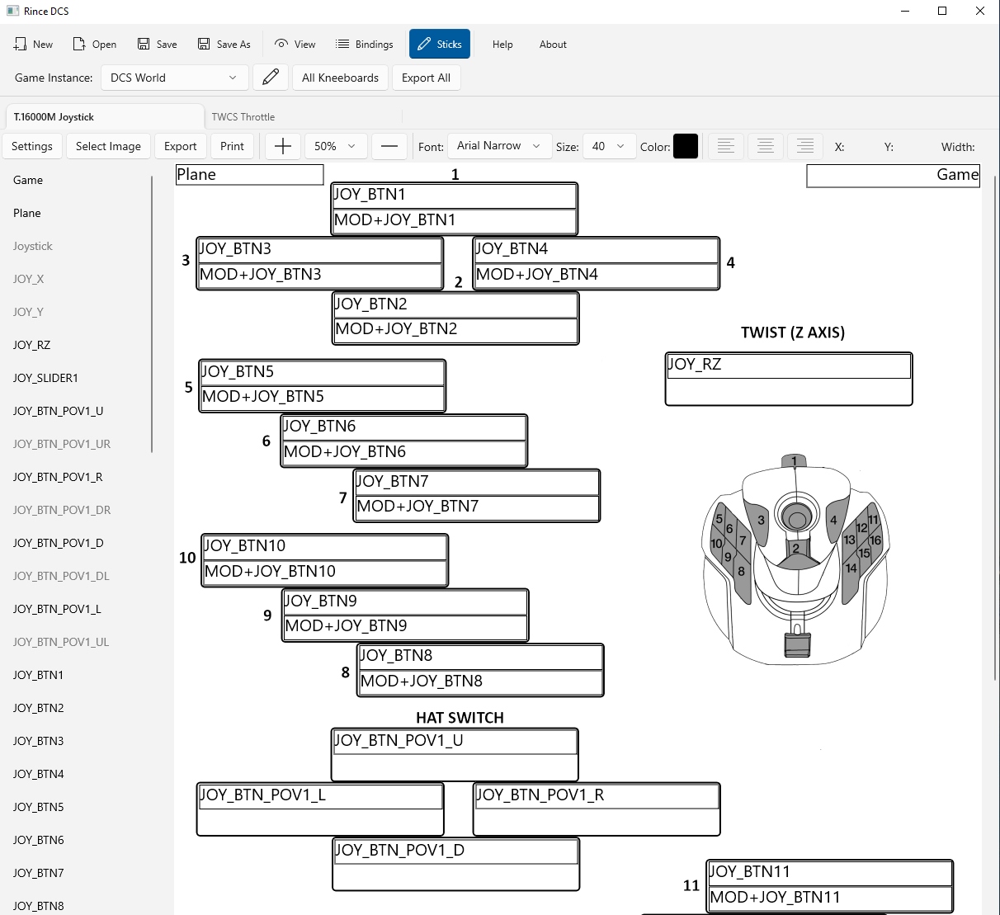

## Edit Joysticks Page

### Overview

The Edit Joysticks page allows you to edit the layout for each of your joysticks.

This page is always available, even if a Game Instance has not been selected.

The first step is to select your joystick image files and to then place the joystick buttons your layout.

The joystick images and button layouts are then saved in your Game file.

The layouts are used across all Game Instances on the View Joystick page.

**Zooming:** Note that the zoom settings carry across to all joysticks on the View and Edit pages.

### Page Controls

- **Tabs** - Use to switch between individual joystick layouts.
- **Settings** - Select to open Settings dialog for the current Joystick.
- **Select Image** - Select to open a find file dialog so you can select the joystick image to use.
- **Export** - the current joystick image to a PNG file.
- **Print** - the current joystick image.
- **+** - Zoom in on the joystick image.
- **Dropdown** - Zoom the joystick image to the selected percentage.
- **-** - Zoom out on the joystick image.
- **Font** - Set the font to use for button labels on this joystick.
- **Size** - Set the font size to use for button labels on this joystick.
- **Color** - Set the text color to use for button labels on this joystick.
- **Justification** - Just the text justification for the currently selected button.
- **Label Details** - On the far right of the page toolbar is displayed the postion and size of the currently selected button.
- **Buttons List** - The list to the left of the image contains all the buttons of the current joystick. Buttons in pale gray have yet to be placed on the layout. The following are special buttons:
	- **Game** - The current instances name. 
	- **Plane** - The current selected aircrafts name.
	- **Joystick** - The joysticks name.
- **Scrolling** - The image and button list can be scrolled as needed. 

### Step 1: Settings

Before starting to place buttons on your joystick layout you may like to set the default button size. You can change the size of individual buttons, as you place it on the layout, or afterwards.

Select the "Settings" button to open the Settings dialog: 

### Step 2: Selecting an Image

Use the "Select Image" button to locate the image to be used for this joystick.

The image should be a PNG file. 

### Step 3: Set Button Text Properties

You can set the Font, Font Size and Color at any time.

These settings are individual to each joystick and are used on all views, exports and printing.

### Step 4: Adding Button to Layout

#### Placing a button using the default settings size.

1. Select the button from the button list.
2. Click on the layout image and the button will be placed where you clicked and sized to the default set in the settings dialog.

#### Placing a button with a custom size.

1. Select the button from the button list.
2. Click on the layout image and hold the mouse button down, move the mouse to resize your button. Release the mouse when it is the right size. 

### Step 5: Button Selection

The new button will now be highlighted on the layout and the Justification menu buttons will be enabled.

The position and size of your button will be displayed.

### Step 6: Adjusting Buttons Position/Size

