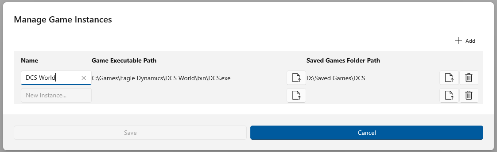

## Manage Game Instances Dialog

- [Back](Introduction.md)

### Overview

Rince DCS does not look for game instances by default, so you must use this dialog to locate the Game Insatnces you wish to work with.

On first use the list will be empty, use the **+ Add** button to add as many instances as you require.

Then select the **EXE** path.

You can edit the default name if you wish.

The system will try to locate the Saved Games folder itself but if it fails or is wrong you can update this as well.

### Dialog Controls

- **+ Add** - Add a new, blank, inatance to the list.
- **Name** - The instances name, can be edited once instances **EXE* file selected.
- **Game Executable Path** - Use the **File** icon to open a file open dialog to select the game instances **EXE* location.
- **Saved Games Folder Path** - Set by default once **EXE** selected but can be changed by using the **File** button to open a file open dialog to select a new Saved Games folder.
- **Delete** - removes the instance from the list..
- **Save** - Save any changes made, new Instances, Renamed Instances, Deleted instances.
- **Cancel** - Close dialog without making any changes.Zoom the joystick image to the selected percentage.
