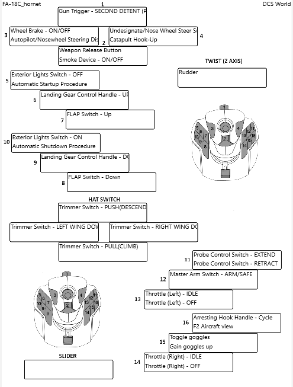

## Rince DCS

### Overview

Rince DCS is a small tool designed to make it easy for the DCS user to generate Joystick layouts of their command to button bindings.

These layouts can then be Printed, Saved as PNG files or exported directly to DCS for use as Kneeboard images.

The tool scans for any attached joysticks on startup. Once a Joystick is found and the Rince DCS file saved the joystick can be unplugged.

**Exmaple Layout**

### Dependencies

1. Windows 10 version 10.0.17763.0 minimum.
1. DCS World, supports multiple versions being installed.
1. Joysticks, attach to your computer the joysticks to be configured.

### Using Rince DCS

To get started with Rince DCS view the [Getting Started](GettingStarted.md) help page.
