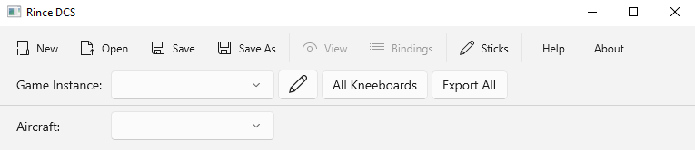

## Main Screen

### Overview

The main screen of Rince DCS gives you direct access to all its functionality.

The screen is divided into three sections.

1. The Main toolbar.
2. The Game Instances toolbar.
3. The Details page area, which changes depending on the option chosen via the main toolbar. 

### Main Toolbar Controls

- **New** - Creates a new Rince DCS file, it will ask if you want to save the current file before creating a new one.
- **Save** - Saves the current state into your Rince DCS file, will ask for files location if it has not been saved before.
- **Save As** - Saves the cyurrent state to a new Rince DCS file.
- **View** - Opens the View Joysticks detail page.
- **Bindings** - Opens the Bindings detail page.
- **Sticks** - Opens the edit Joysticks page.
- **Help** - Opens a new Window for displaying this help content.
- **About** - Opens the Rince DCS about dialog, wth details of the current version.

### Game Instances Toolbar Controls

- **Game Instance** - A dropdown of currently configured Game Instances. Choose from this list the current instance to be viewed.
- **Edit Instances** - Use this to manage the Game Instances.
- **All Kneeboards** - Export to the Aircraft Kneeboard folders in this instances Saved Games folder all PNG images for all Joysticks.
- **Export All** - Export to a folder of your choosing PNG images for all Aircraft for all Joysticks.

### Detail Pages Area

- **Aircraft**
	- This is only populated once an instance is selected. 
	- It is not visibly on the Edit Joysticks page as this is not filtered by Aircraft.
	- Only Aircraft that you have exported a HTML bindings file for from within DCS are visible.

See the individual detail pages for further details.

- [View Joysticks Page](ViewJoysticks.md)
- [View Bindings Page](Bindings.md)
- [Edit Joysticks Page](EditJoysticks.md)
