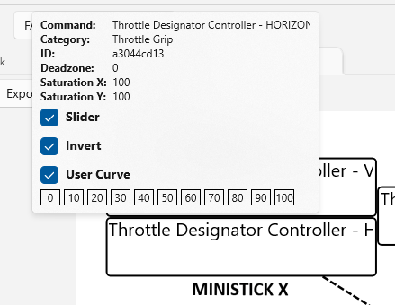

## View Joysticks Page

- [Back](Introduction.md)

### Overview

The View Joysticks page displays the current bindings for each of your Joysticks.

This page is only available when a Game instance has been selected.

The bindings displayed are loaded from DCS each time you start the application.

### Page Controls

- **Aircraft** - Display joystick bindings for this Aircraft.
- **Tabs** - Use to view individual joystick bindings.
- **Kneeboard** - Export the current Joystick image to the DCS Kneeboards folder for the currently selected Aircraft.
- **Export** - the current Joystick image as a PNG file.
- **Print** - the current Joystick image.
- **+** - Zoom in on the joystick image.
- **Dropdown** - Zoom the joystick image to the selected percentage.
- **-** - Zoom out on the joystick image.
- **Scrolling** - The image can be scrolled as needed. 

### Usage

- Hovering your mouse over a command label will cause the Comand Info Popup to appear.

 