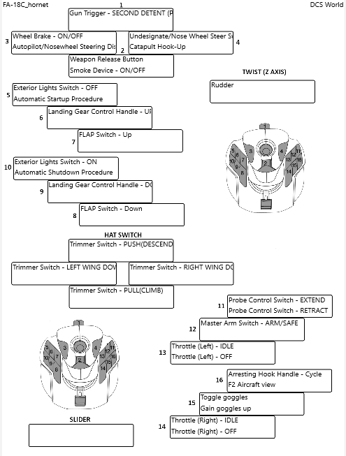

## Rince DCS

### Overview

Rince DCS is a small tool designed to make it easy for the DCS user to generate Joystick layouts of their command to button bindings.

These layouts can then be Printed, Saved as PNG files or exported directly to DCS for use as Kneeboard images.

The tool scans for any attached joysticks on startup. Once a Joystick is found and the Rince DCS file saved the joystick can be unplugged.

**Exmaple Layout**

### Dependencies

1. Windows 10 version 10.0.17763.0 minimum.
1. DCS World, supports multiple versions being installed.
1. Joysticks, attach to your computer the joysticks to be configured.

### Using Rince DCS

To get started with Rince DCS view the [Getting Started](Help/GettingStarted.md) help page.

### Acknowledgement

This utility only exists because of the work of Holdi601 and his [Joystick Profiler](https://github.com/Holdi601/JoystickProfiler) project.

On starting to fly in DCS I quickly saw the need for Joystick layouts that I could view/print.

Started off finding and downloading some static images but these quickly became a pain as I was manually writing my contol mappings onto them!

Searching I came across JoystickProfiler and started using this, not only could I generate images/kneeboards of my control mapping I could update them as well!

As a retired programmer I started delving into the JoystickProfilers code base when I could not grasp how things where working.

Then I realised I wanted to make some changes but quickly realised the old adage is true, reading code is way harder then writing it!

All this had me itching to try my hand at some modern windows development, so Rince DCS was born. 

So thanks again Holdi601, it has been an interesting expeience delving into your code, and enjoyable creating my own take on some of the functionality.

### Contents

- [Introduction](Help/Introduction.md)
- [Getting Started](Help/GettingStarted.md)
- [Save File](Help/SaveFile.md)
- [Main Screen](Help/MainScreen.md)
- [Manage Game Instances](Help/InstancesDialog.md)
- [View Joysticks Page](Help/ViewJoysticks.md)
- [View Bindings Page](Help/Bindings.md)
- [Edit Joysticks Page](Help/EditJoysticks.md)
